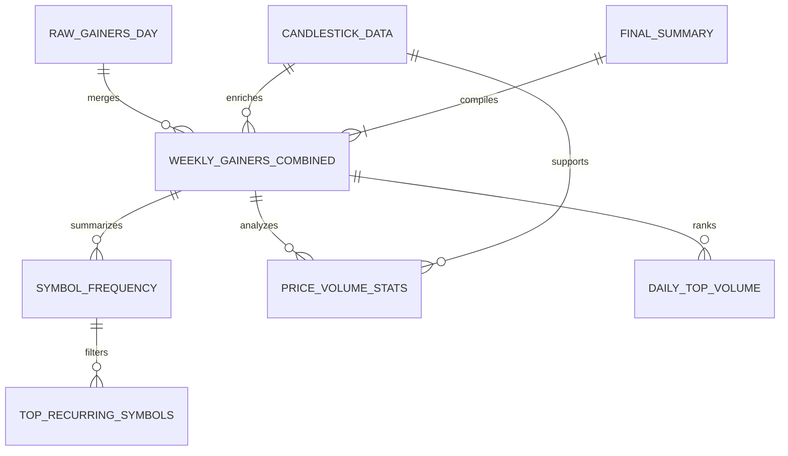

# ERD Report: Daily Stock Gainer Analysis

## What This Report Is
This report presents the Entity Relationship Diagram (ERD) for processing and analyzing daily stock gainer data from financial news sources. The goal is to generate insights and visualizations for financial and non-financial stakeholders using a week's worth of data.

## Use Cases
- **Recurring Stocks**: Identify which stocks appear multiple times in a week.
- **Price Ranges & Volume Trends**: Understand the general distribution of stock prices and traded volume.
- **Top Movers**: Highlight stocks with the highest trading activity.
- **Data Visualization Prep**: Prepare data for histogram and candlestick charts.

## Methods
1. Merge daily CSV files into a `weekly_gainers_combined` table.
2. Generate intermediate summaries such as frequency of stock appearances and average price/volume by day.
3. Use `candlestick_data` to supplement weekly data with detailed historical trends.
4. Create final tables for visualization and reporting.

## Summary
The ERD reflects a pipeline from raw gainer data into actionable summaries. The structure facilitates reuse, extensibility, and smooth transition into Snowflake for further analytics. Future analysis could include clustering of gainers by sector, correlation with index movements, or sentiment tagging from news articles.
